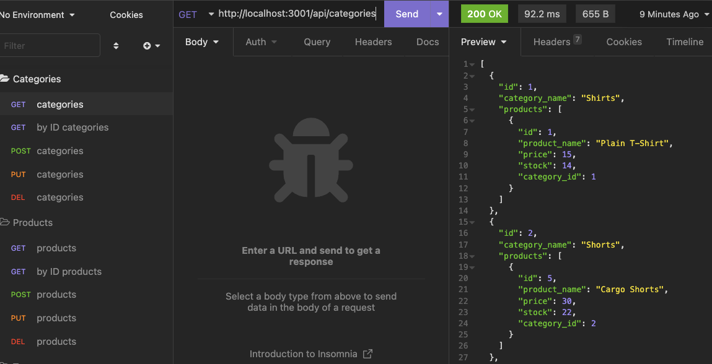

# Object_Relational_Mapping

## Description

This is a project that utilizes sequelize to create the back-end of an e-commerce company. This company will have the ability to get, get by ID, add, change and delete contents of 3 different tables. 

## Showcase

Please see the video below for an example of how this project works:

https://www.awesomescreenshot.com/video/12462931?key=15911b75423b4a31e76dfc9ea9b6a565

Here is an example of the GET route for the category table in Insomnia:

## Self-Improvement 

This project allowed me to utilize and further develop my skills in SQL to create the back-end routes for an e-commerce company.  I also gained more experience with Insomnia and testing the routes written in my code.

## License

  
---
